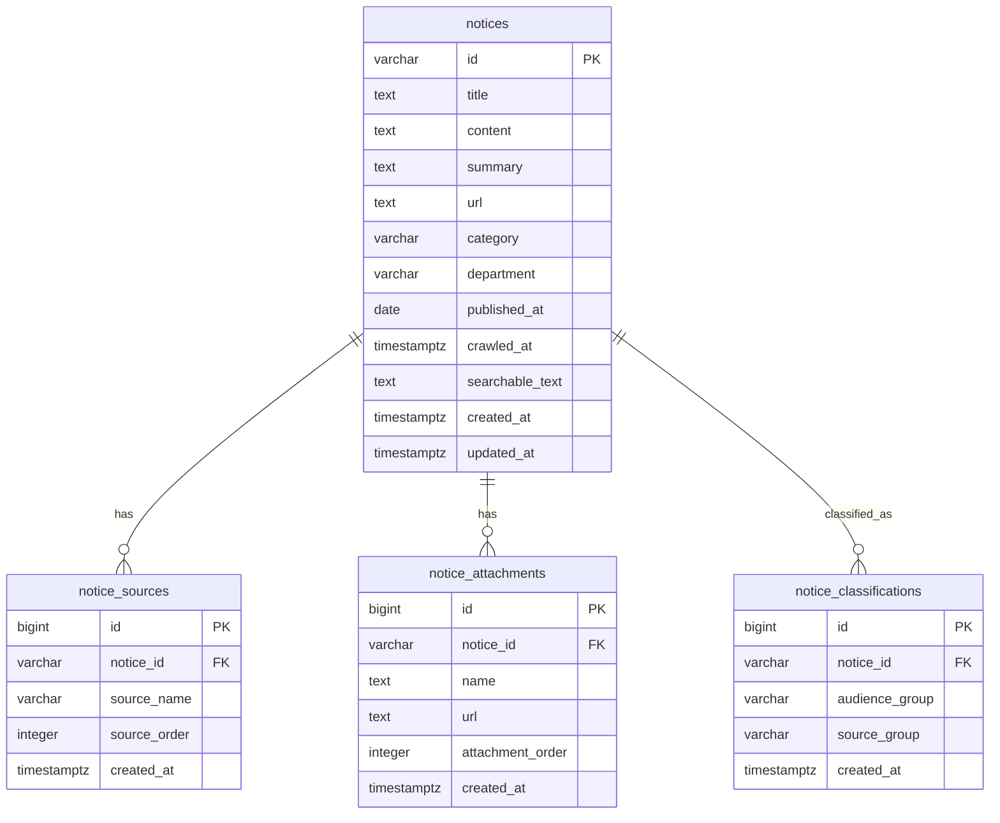

# ERD

## 범위
이 문서는 KAU Notice Hub 독립 백엔드의 데이터 모델을 정의한다.

초기 MVP 백엔드는 단순하게 시작한다.

- 실행 저장소는 크롤러가 생성한 JSON 파일로 시작한다.

이 ERD는 JSON 저장소에서 정규화해 사용하는 논리 모델을 설명한다.

## 핵심 개념
| 개념 | 설명 |
| --- | --- |
| 공지 | 사용자에게 노출되는 정규화된 공지 데이터 |
| 공지 출처 | 한 공지가 속한 원본 홈페이지. 한 공지가 여러 출처를 가질 수 있음 |
| 분류 | `CLASSIFICATION.md` 기준으로 계산되는 대상자 대분류/중분류 |
| 첨부파일 | 원본 공지에 연결된 파일 |

## 분류 필드
분류 기준은 [CLASSIFICATION.md](CLASSIFICATION.md)를 따른다.

| 필드 | 의미 | 현재 처리 방식 |
| --- | --- | --- |
| `audienceGroup` | 대상자 대분류 | 요청 시점 계산 |
| `sourceGroup` | 대표 중분류 | 요청 시점 계산 |
| `sourceGroups` | 매칭된 전체 중분류 | 요청 시점 계산 |
| `source` | 대표 출처 홈페이지 | 원천 데이터에서 정규화 |
| `sources` | 전체 출처 홈페이지 목록 | 원천 데이터에서 정규화 |

초기 MVP에서 분류값은 수동 편집 데이터가 아니라, 항상 결정적 함수로 계산한다.

## Mermaid ERD


## 테이블
### `notices`
정규화된 공지 1건을 저장한다.

| 컬럼 | 타입 | 필수 | 설명 |
| --- | --- | --- | --- |
| `id` | `varchar` | 예 | 안정적인 공지 ID. 크롤러가 제공하지 않으면 제목/날짜/출처 기반으로 생성하고 중복을 보정한다. |
| `title` | `text` | 예 | 공지 제목. fallback: `제목 없음 공지 N`. |
| `content` | `text` | 예 | 공지 본문. fallback: `본문 정보가 비어 있습니다.` |
| `summary` | `text` | 아니오 | 요약. 없으면 본문에서 생성한다. |
| `url` | `text` | 아니오 | 원문 공지 URL. |
| `category` | `varchar` | 아니오 | `category`, `category_raw`, `type` 중 첫 번째 정규화 값. |
| `department` | `varchar` | 아니오 | 부서/기관명. |
| `published_at` | `date` | 아니오 | `date`, `published_at`, `created_at`, `updated_at`에서 정규화한 게시일. |
| `crawled_at` | `timestamptz` | 아니오 | 크롤러 수집 시각. |
| `searchable_text` | `text` | 아니오 | 단순 검색용 사전 계산 텍스트. |
| `created_at` | `timestamptz` | 예 | DB 행 생성 시각. |
| `updated_at` | `timestamptz` | 예 | DB 행 수정 시각. |

권장 인덱스:

```sql
CREATE INDEX idx_notices_published_at ON notices (published_at DESC);
CREATE INDEX idx_notices_category ON notices (category);
CREATE INDEX idx_notices_department ON notices (department);
```

MVP 검색은 메모리 문자열 매칭으로 처리한다.

### `notice_sources`
공지별 전체 출처 홈페이지를 저장한다.

| 컬럼 | 타입 | 필수 | 설명 |
| --- | --- | --- | --- |
| `id` | `bigint` | 예 | 대체 기본키. |
| `notice_id` | `varchar` | 예 | `notices.id` FK. |
| `source_name` | `varchar` | 예 | 정규화된 출처 홈페이지 이름. |
| `source_order` | `integer` | 예 | `0`이면 대표 출처. |
| `created_at` | `timestamptz` | 예 | DB 행 생성 시각. |

규칙:

- 원천 `source_name`은 문자열 또는 배열일 수 있다.
- 첫 번째 정규화 source는 API의 `Notice.source`가 된다.
- 전체 정규화 source는 API의 `Notice.sources`가 된다.
- source 필터는 대표 출처만 보지 않고 모든 출처를 대상으로 매칭해야 한다.

권장 인덱스:

```sql
CREATE INDEX idx_notice_sources_notice_id ON notice_sources (notice_id);
CREATE INDEX idx_notice_sources_source_name ON notice_sources (source_name);
CREATE UNIQUE INDEX uq_notice_sources_notice_source
  ON notice_sources (notice_id, source_name);
```

### `notice_classifications`
분류 결과의 논리 구조를 나타낸다.

| 컬럼 | 타입 | 필수 | 설명 |
| --- | --- | --- | --- |
| `id` | `bigint` | 예 | 대체 기본키. |
| `notice_id` | `varchar` | 예 | `notices.id` FK. |
| `audience_group` | `varchar` | 예 | 대상자 대분류. 예: `전 구성원 공통`. |
| `source_group` | `varchar` | 아니오 | 중분류. 중분류가 없는 대분류에서는 null 가능. |
| `created_at` | `timestamptz` | 예 | DB 행 생성 시각. |

규칙:

- MVP JSON 구현에서는 이 값을 요청 시점에 계산한다.
- 한 공지가 여러 중분류에 매칭되면 여러 row를 저장한다.
- 중분류가 없는 대분류는 `source_group = null` 행을 하나 저장하는 방식을 권장한다.

권장 인덱스:

```sql
CREATE INDEX idx_notice_classifications_notice_id
  ON notice_classifications (notice_id);

CREATE INDEX idx_notice_classifications_audience_group
  ON notice_classifications (audience_group);

CREATE INDEX idx_notice_classifications_audience_source_group
  ON notice_classifications (audience_group, source_group);
```

### `notice_attachments`
공지 첨부파일을 저장한다.

| 컬럼 | 타입 | 필수 | 설명 |
| --- | --- | --- | --- |
| `id` | `bigint` | 예 | 대체 기본키. |
| `notice_id` | `varchar` | 예 | `notices.id` FK. |
| `name` | `text` | 예 | 첨부파일 표시명. fallback: `첨부파일`. |
| `url` | `text` | 예 | 첨부파일 URL. |
| `attachment_order` | `integer` | 예 | 원본 순서. |
| `created_at` | `timestamptz` | 예 | DB 행 생성 시각. |

권장 인덱스:

```sql
CREATE INDEX idx_notice_attachments_notice_id
  ON notice_attachments (notice_id);

CREATE UNIQUE INDEX uq_notice_attachments_notice_url
  ON notice_attachments (notice_id, url);
```

## API 논리 모델
DB 모델은 프론트엔드가 사용하는 `Notice` 객체로 변환된다.

```ts
interface Notice {
  id: string;
  title: string;
  content: string;
  url?: string;
  source?: string;
  sources?: string[];
  audienceGroup?: string;
  sourceGroup?: string;
  sourceGroups?: string[];
  category?: string;
  department?: string;
  date?: string;
  summary?: string;
  tags: string[];
  attachments: NoticeAttachment[];
}
```

매핑:

| API 필드 | 출처 |
| --- | --- |
| `id` | `notices.id` |
| `title` | `notices.title` |
| `content` | `notices.content` |
| `url` | `notices.url` |
| `source` | `source_order = 0`인 `notice_sources.source_name` |
| `sources` | `source_order` 순서의 전체 `notice_sources.source_name` |
| `audienceGroup` | 요청 시점 계산값 또는 `notice_classifications.audience_group` |
| `sourceGroup` | 분류 순서상 첫 번째 중분류 |
| `sourceGroups` | 분류 순서상 전체 중분류 |
| `category` | `notices.category` |
| `department` | `notices.department` |
| `date` | `notices.published_at`의 `YYYY-MM-DD` 문자열 |
| `summary` | `notices.summary` |
| `tags` | MVP에서는 category와 sources에서 파생 |
| `attachments` | `notice_attachments` 행 목록 |

## MVP JSON 형태
크롤러 JSON은 초기 저장 포맷으로 유지할 수 있다.

백엔드 서버가 실행 중이어도 크롤러는 별도 주기 작업으로 실행할 수 있다. 크롤러 결과 파일 갱신, atomic 교체, 백엔드 캐시 재로드 정책은 [CRAWLING_UPDATE.md](CRAWLING_UPDATE.md)를 따른다.

권장 원천 레코드:

```json
{
  "id": "optional-stable-id",
  "title": "공지 제목",
  "content": "공지 본문",
  "source_name": "한국항공대학교 공식 홈페이지",
  "source_type": "kau_official",
  "category_raw": "학사",
  "department": "교무처",
  "published_at": "2026-04-20",
  "original_url": "https://example.com/notice/1",
  "attachments": []
}
```

복수 출처 예시:

```json
{
  "title": "복수 홈페이지에 노출된 공지",
  "source_name": [
    "한국항공대학교 컴퓨터공학과",
    "한국항공대학교 소프트웨어학과"
  ],
  "category_raw": ["공지", "학사"]
}
```
