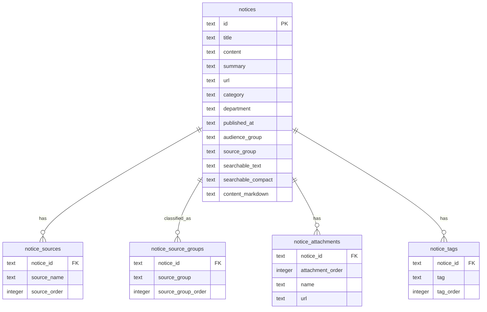

# ERD

## 범위

이 문서는 KAU Notice Hub 백엔드의 현재 데이터 모델을 정의한다.

저장 구조:

- 크롤러는 전체 공지 스냅샷 JSON 파일(`NOTICE_JSON_PATH`)을 atomic하게 게시한다. JSON은 SQLite 부트스트랩 원천이자 안전망이다.
- JSON 게시 직후 서버 내장 크롤러 스케줄러는 `app/ingest.py`로 동일 데이터를 SQLite DB(`NOTICE_DB_PATH`)에 atomic하게 반영한다.
- API는 SQLite DB(`app/sqlite_repository.py`)를 우선 읽어 응답한다.
- DB 파일이 없거나 스키마 버전이 맞지 않으면 JSON에서 자동 부트스트랩한다.
- JSON 부트스트랩도 실패하면 `JsonNoticeRepository`로 폴백한다.

## 핵심 개념

| 개념 | 설명 |
| --- | --- |
| 공지 | 사용자에게 노출되는 정규화된 공지 데이터 |
| 공지 출처 | 한 공지가 속한 원본 홈페이지. 한 공지가 여러 출처를 가질 수 있음 |
| 중분류 | `CLASSIFICATION.md` 기준으로 계산되는 source group. 한 공지가 여러 중분류에 매칭될 수 있음 |
| 첨부파일 | 원본 공지에 연결된 파일 |
| 태그 | 검색/표시에 쓰는 정규화 태그 |

## 분류 필드

분류 기준은 [CLASSIFICATION.md](CLASSIFICATION.md)를 따른다.

| 필드 | 의미 | 현재 처리 방식 |
| --- | --- | --- |
| `audienceGroup` | 대상자 대분류 | ingest 시점 계산 후 `notices.audience_group`에 저장. JSON fallback은 요청 시점 계산 |
| `sourceGroup` | 대표 중분류 | ingest 시점 계산 후 `notices.source_group`에 저장 |
| `sourceGroups` | 매칭된 전체 중분류 | ingest 시점 계산 후 `notice_source_groups`에 순서대로 저장 |
| `source` | 대표 출처 홈페이지 | `notice_sources.source_order = 0` |
| `sources` | 전체 출처 홈페이지 목록 | `notice_sources`를 `source_order` 순서로 반환 |

분류값은 수동 편집 데이터가 아니라 `app/classification.py`의 결정적 함수로 계산한다.

## Mermaid ERD



`schema_meta(key, value)`는 `SCHEMA_VERSION`을 저장하는 메타 테이블이다.

## 실제 SQLite 스키마

`app/db.py`가 테이블과 인덱스를 정의한다. 스키마 버전은 `db.SCHEMA_VERSION`이며 현재 버전은 `3`다. 버전이 맞지 않으면 부팅 시 기존 DB를 제거하고 JSON에서 다시 ingest한다.

### `notices`

정규화된 공지 1건을 저장한다.

| 컬럼 | 타입 | 필수 | 설명 |
| --- | --- | --- | --- |
| `id` | `text` | 예 | 안정적인 공지 ID. 중복 ID는 ingest 시 suffix로 보정 |
| `title` | `text` | 예 | 공지 제목 |
| `content` | `text` | 예 | Markdown(CommonMark + GFM 표) 문자열 |
| `summary` | `text` | 아니오 | 요약. 없으면 정규화 단계에서 본문 기반으로 생성 가능 |
| `url` | `text` | 아니오 | 원문 공지 URL |
| `category` | `text` | 아니오 | 정규화된 category |
| `department` | `text` | 아니오 | 부서/기관명 |
| `published_at` | `text` | 아니오 | `YYYY-MM-DD` 게시일 문자열 |
| `audience_group` | `text` | 아니오 | 계산된 대상자 대분류 |
| `source_group` | `text` | 아니오 | 대표 중분류 |
| `searchable_text` | `text` | 아니오 | 검색 후보 선별용 텍스트 |
| `searchable_compact` | `text` | 아니오 | 공백/구두점 제거 검색 텍스트 |
| `content_markdown` | `text` | 아니오 | ingest 시 미리 정규화한 본문 Markdown. 읽기 경로는 이 값을 그대로 반환하고, `NULL`인 레거시 row만 읽을 때 `content`를 정규화한다 |

인덱스:

- `idx_notices_published_at`
- `idx_notices_audience_group`
- `idx_notices_source_group`
- `idx_notices_category`
- `idx_notices_department`

### `notice_sources`

공지별 전체 출처 홈페이지를 저장한다.

| 컬럼 | 타입 | 필수 | 설명 |
| --- | --- | --- | --- |
| `notice_id` | `text` | 예 | `notices.id` FK |
| `source_name` | `text` | 예 | 정규화된 출처 홈페이지 이름 |
| `source_order` | `integer` | 예 | `0`이면 대표 출처 |

기본키는 `(notice_id, source_name)`이다. `source_name`에는 `idx_notice_sources_source_name` 인덱스가 있다.

규칙:

- 원천 `source_name`은 문자열 또는 배열일 수 있다.
- 첫 번째 정규화 source는 API의 `Notice.source`가 된다.
- 전체 정규화 source는 API의 `Notice.sources`가 된다.
- source 필터는 대표 출처만 보지 않고 모든 출처를 대상으로 매칭한다.

### `notice_source_groups`

공지별 전체 중분류를 저장한다.

| 컬럼 | 타입 | 필수 | 설명 |
| --- | --- | --- | --- |
| `notice_id` | `text` | 예 | `notices.id` FK |
| `source_group` | `text` | 예 | 계산된 중분류 |
| `source_group_order` | `integer` | 예 | API 반환 순서 |

기본키는 `(notice_id, source_group)`이다. `source_group`에는 `idx_notice_source_groups_source_group` 인덱스가 있다.

규칙:

- 한 공지가 여러 중분류에 매칭되면 여러 row를 저장한다.
- API의 `sourceGroup`은 `notices.source_group`, `sourceGroups`는 이 테이블에서 만든다.

### `notice_attachments`

공지 첨부파일을 저장한다.

| 컬럼 | 타입 | 필수 | 설명 |
| --- | --- | --- | --- |
| `notice_id` | `text` | 예 | `notices.id` FK |
| `attachment_order` | `integer` | 예 | 원본 순서 |
| `name` | `text` | 예 | 첨부파일 표시명 |
| `url` | `text` | 예 | 첨부파일 URL |

기본키는 `(notice_id, attachment_order)`이다.

### `notice_tags`

공지 태그를 저장한다.

| 컬럼 | 타입 | 필수 | 설명 |
| --- | --- | --- | --- |
| `notice_id` | `text` | 예 | `notices.id` FK |
| `tag` | `text` | 예 | 정규화 태그 |
| `tag_order` | `integer` | 예 | API 반환 순서 |

기본키는 `(notice_id, tag)`이다.

### `notice_facets_cache`

목록/검색 응답의 facet(필터 선택지) 결과를 미리 계산해 저장한다. facet은 데이터가 바뀔 때만(즉 ingest 시) 달라지므로, 요청마다 재계산하지 않고 ingest 시 한 번 계산해 둔다.

| 컬럼 | 타입 | 필수 | 설명 |
| --- | --- | --- | --- |
| `audience` | `text` | 예 | 정규화된 audience 필터 키. 무필터는 빈 문자열 `''` |
| `source_group` | `text` | 예 | 정규화된 source group 필터 키. 무필터는 빈 문자열 `''` |
| `payload` | `text` | 예 | `audienceGroups`/`sourceGroups`/`sources`/`categories`/`departments`를 담은 JSON |

기본키는 `(audience, source_group)`이다. ingest 시 `app/sqlite_repository.py`의 `build_and_store_facets`가 `(audience, source_group)` 조합을 모두 채운다. 읽기 경로는 이 테이블을 조회하고, 캐시 미스(레거시 DB, 알 수 없는 audience)면 기존처럼 live로 계산해 동작을 보존한다.

### `schema_meta`

스키마 메타데이터를 저장한다.

| 컬럼 | 타입 | 필수 | 설명 |
| --- | --- | --- | --- |
| `key` | `text` | 예 | 메타데이터 키 |
| `value` | `text` | 예 | 메타데이터 값 |

현재 `key='version'`에 `SCHEMA_VERSION` 값을 저장한다.

## API 논리 모델

DB 모델은 프론트엔드가 사용하는 `Notice` 객체로 변환된다.

```ts
interface Notice {
  id: string;
  title: string;
  content: string;
  url?: string;
  source?: string;
  sources?: string[];
  audienceGroup?: string;
  sourceGroup?: string;
  sourceGroups?: string[];
  category?: string;
  department?: string;
  date?: string;
  summary?: string;
  tags: string[];
  attachments: NoticeAttachment[];
}
```

매핑:

| API 필드 | 출처 |
| --- | --- |
| `id` | `notices.id` |
| `title` | `notices.title` |
| `content` | `notices.content` |
| `url` | `notices.url` |
| `source` | `source_order = 0`인 `notice_sources.source_name` |
| `sources` | `source_order` 순서의 전체 `notice_sources.source_name` |
| `audienceGroup` | `notices.audience_group` |
| `sourceGroup` | `notices.source_group` |
| `sourceGroups` | `source_group_order` 순서의 전체 `notice_source_groups.source_group` |
| `category` | `notices.category` |
| `department` | `notices.department` |
| `date` | `notices.published_at` |
| `summary` | `notices.summary` |
| `tags` | `tag_order` 순서의 전체 `notice_tags.tag` |
| `attachments` | `attachment_order` 순서의 `notice_attachments` 행 목록 |

## JSON 원천 형태

크롤러 JSON은 SQLite의 원천 데이터 포맷으로 유지된다. 크롤러 결과 파일 갱신, atomic 교체, SQLite 동기화 정책은 [CRAWLING_UPDATE.md](CRAWLING_UPDATE.md)를 따른다.

권장 원천 레코드:

```json
{
  "id": "optional-stable-id",
  "title": "공지 제목",
  "content": "공지 본문",
  "source_name": "한국항공대학교 공식 홈페이지",
  "source_type": "kau_official",
  "category_raw": "학사",
  "department": "교무처",
  "published_at": "2026-04-20",
  "original_url": "https://example.com/notice/1",
  "attachments": []
}
```

복수 출처 예시:

```json
{
  "title": "복수 홈페이지에 노출된 공지",
  "source_name": [
    "한국항공대학교 컴퓨터공학과",
    "한국항공대학교 소프트웨어학과"
  ],
  "category_raw": ["공지", "학사"]
}
```
